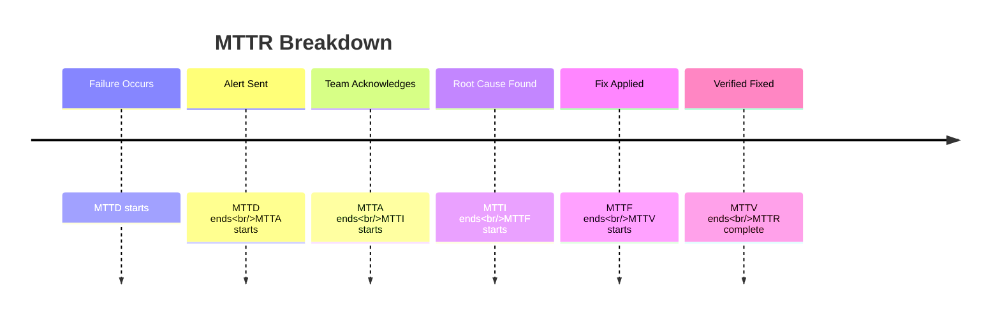

# MTBF & MTTR

**MTBF** (Mean Time Between Failures) and **MTTR** (Mean Time To Repair) are industry-standard reliability metrics that Saturn tracks automatically.

## MTBF: Mean Time Between Failures

**Definition**: Average time between incidents

**Formula**:
```
MTBF = Total Uptime / Number of Incidents
```

**Example**:
```
Period: 30 days (720 hours)
Incidents: 3
Downtime: 2 hours total

MTBF = (720 - 2) / 3 = 239.3 hours
```

**Interpretation**: On average, this monitor runs for 239 hours (≈10 days) before an incident occurs.

### MTBF Targets

| Target | Quality Level |
|--------|---------------|
| > 720 hours (30 days) | Excellent |
| 360-720 hours (15-30 days) | Good |
| 168-360 hours (7-15 days) | Acceptable |
| 72-168 hours (3-7 days) | Needs improvement |
| < 72 hours (3 days) | Poor |

### Improving MTBF

1. **Fix root causes**: Don't just resolve incidents, prevent recurrence
2. **Add redundancy**: Fallback mechanisms for dependencies
3. **Better error handling**: Graceful degradation instead of failures
4. **Proactive maintenance**: Fix issues before they cause incidents

## MTTR: Mean Time To Repair

**Definition**: Average time from incident creation to resolution

**Formula**:
```
MTTR = Σ(Incident Duration) / Number of Incidents
```

**Example**:
```
Incidents:
1. Oct 5: 3h 20m (200 minutes)
2. Oct 15: 45m
3. Oct 22: 2h 10m (130 minutes)

MTTR = (200 + 45 + 130) / 3 = 125 minutes ≈ 2.08 hours
```

**Interpretation**: On average, it takes 2 hours to resolve an incident for this monitor.

### MTTR Targets

| Target | Response Quality |
|--------|------------------|
| < 15 minutes | Excellent (automated recovery) |
| 15-60 minutes | Good (quick manual fix) |
| 1-4 hours | Acceptable |
| 4-24 hours | Slow |
| > 24 hours | Critical issue |

### Improving MTTR

1. **Faster detection**: Reduce time from failure to alert
2. **Better alerts**: Include context, logs, likely causes
3. **Runbooks**: Document common fixes
4. **Automation**: Auto-remediation for known issues
5. **On-call rotation**: Ensure someone can respond 24/7

## MTTR Components

Break down MTTR into phases:



### MTTD: Mean Time To Detect

Time from failure to alert creation.

**Improve by**:
- Shorter grace periods
- Start pings for long-running jobs
- Proactive health checks

### MTTA: Mean Time To Acknowledge

Time from alert to team acknowledgment.

**Improve by**:
- 24/7 on-call rotation
- Multi-channel alerting
- Escalation policies

### MTTI: Mean Time To Investigate

Time to identify root cause.

**Improve by**:
- Better logging and output capture
- Historical context in alerts
- Dashboards for quick diagnosis

### MTTF: Mean Time To Fix

Time to implement fix.

**Improve by**:
- Automation (runbooks, scripts)
- Pre-approved changes
- Rollback mechanisms

### MTTV: Mean Time To Verify

Time to confirm fix worked.

**Improve by**:
- Automated verification
- Quick feedback loops
- Monitoring fix impact

## Dashboard Visualization

```
Monitor: Database Backup

┌─────────────────────────────────────────┐
│ MTBF: 15.2 days  (↗ +3.1 vs last month)│
│ MTTR: 1.8 hours  (↘ -0.4 vs last month)│
└─────────────────────────────────────────┘

Recent Incidents:
━━━━━━━━━━━━━━━━━━━━━━━━━━━━━━━━━━━━━━━━━
Oct 5  │ MISSED │ 3h 20m │ MTTD: 5m, MTTA: 12m
Oct 15 │ FAIL   │ 45m    │ MTTD: 1m, MTTA: 3m
Oct 22 │ MISSED │ 2h 10m │ MTTD: 5m, MTTA: 8m
```

## Industry Benchmarks

### By Industry

| Industry | Avg MTBF | Avg MTTR |
|----------|----------|----------|
| SaaS | 20-30 days | 1-2 hours |
| E-commerce | 15-25 days | 30-90 min |
| Financial | 30-45 days | 15-60 min |
| Healthcare | 25-40 days | 1-3 hours |

### By Criticality

| Priority | Target MTBF | Target MTTR |
|----------|-------------|-------------|
| Critical | > 30 days | < 30 min |
| High | > 15 days | < 2 hours |
| Medium | > 7 days | < 8 hours |
| Low | > 3 days | < 24 hours |

## Availability Calculation

MTBF and MTTR combine to determine availability:

```
Availability = MTBF / (MTBF + MTTR)
```

**Example**:
```
MTBF: 240 hours (10 days)
MTTR: 2 hours

Availability = 240 / (240 + 2) = 99.17%
```

### Target Availability

| Availability | MTBF Needed (for 2h MTTR) |
|--------------|----------------------------|
| 99.9% ("3 nines") | 2,000 hours (83 days) |
| 99.5% | 400 hours (17 days) |
| 99% | 200 hours (8 days) |
| 95% | 40 hours (1.7 days) |

## API Access

```bash
# Get MTBF/MTTR for a monitor
GET /api/monitors/YOUR_MONITOR_ID/reliability

Response:
{
  "monitorId": "mon_abc123",
  "period": "30d",
  "mtbf": {
    "hours": 239.3,
    "days": 9.97,
    "trend": "improving"
  },
  "mttr": {
    "minutes": 125,
    "hours": 2.08,
    "trend": "stable",
    "breakdown": {
      "mttd": 3.7,
      "mtta": 8.2,
      "mtti": 45.3,
      "mttf": 52.1,
      "mttv": 15.7
    }
  },
  "availability": 99.13
}
```

## Reports

Export MTBF/MTTR reports:

```bash
curl -X POST https://api.saturn.example.com/api/reports/reliability \
  -H "Authorization: Bearer YOUR_TOKEN" \
  -d '{
    "monitorIds": ["mon_abc123"],
    "startDate": "2025-10-01",
    "endDate": "2025-10-31"
  }' > reliability-report.pdf
```

## Next Steps

- [Health Scores](./health-score) — Overall reliability grading
- [Uptime & SLA](./uptime-sla) — Track uptime percentages
- [Incident Lifecycle](../incidents/lifecycle) — Managing incidents efficiently

