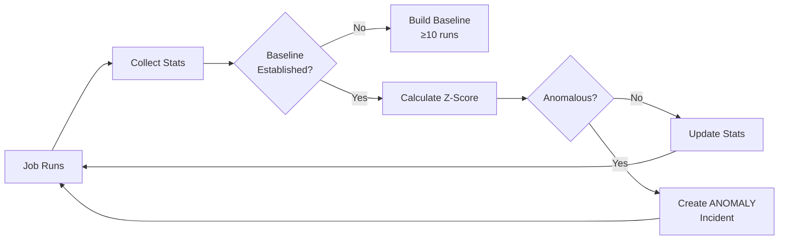

# Anomaly Detection Overview

**Anomaly detection** is what makes Saturn different. While other monitors only tell you when jobs fail, Saturn alerts you when jobs **succeed but behave abnormally** — often catching problems before they escalate to failures.

## The Problem with Binary Monitoring

Traditional monitoring is binary: ✅ Success or ❌ Failure.

This misses critical signals:

```
Day 1: Backup completes in 10 minutes ✅
Day 2: Backup completes in 12 minutes ✅
Day 3: Backup completes in 45 minutes ✅  ← Problem brewing
Day 4: Backup times out after 60 minutes ❌  ← Too late!
```

With anomaly detection, you're alerted on **Day 3** when the job is still succeeding but taking 3.5x longer than normal.

## How It Works



### Step 1: Baseline Collection

For the first **10 successful runs**, Saturn collects data without triggering anomaly alerts:

- Duration (milliseconds)
- Output size (bytes)
- Exit code
- Timestamp

### Step 2: Statistical Calculation

Using **Welford's online algorithm** (see [Welford's Algorithm](./welford)), Saturn calculates:

- **Mean** (μ): Average duration
- **Standard Deviation** (σ): Measure of variability
- **Median**: Middle value
- **Min/Max**: Performance bounds

These are updated incrementally with each run — no need to store all historical data.

### Step 3: Anomaly Detection

Each new run is compared against the baseline using multiple rules (see [Anomaly Rules](./rules)):

1. **Z-Score Rule**: Duration > mean + 3σ
2. **Median Multiplier**: Duration > 5× median
3. **Output Size Drop**: Output < 50% of median

If any rule triggers, an **ANOMALY incident** is created.

## Why Statistics Matter

### Example: Database Backup Job

**Historical Performance** (50 runs):
- Mean: 12.3 minutes
- Std Dev: 1.8 minutes
- Median: 12.1 minutes

**Today's Run**:
- Duration: 24.7 minutes
- Exit code: 0 (success)
- Output: "Backup completed"

**Analysis**:
```
Z-Score = (24.7 - 12.3) / 1.8 = 6.9
Threshold: 3.0
Result: ANOMALY (6.9 > 3.0)
```

**Incident Message**:
```
ANOMALY: Database Backup ran 6.9 standard deviations slower than normal
Duration: 24.7 minutes (typical: 12.3 ± 1.8 minutes)
Possible causes:
- Increased data volume
- Database performance degradation
- Resource contention
- Network latency
```

## Baseline Requirements

| Requirement | Value | Reason |
|-------------|-------|--------|
| **Minimum runs** | 10 | Statistical validity |
| **Successful runs only** | Required | Failed runs skew statistics |
| **Recent data priority** | Last 100 runs | Adapts to changing patterns |

:::info Baseline Status
View baseline status in monitor settings. You'll see:
- "Collecting baseline (5/10 runs)"
- "Baseline established ✓"
:::

## What Gets Detected

### Performance Degradation

```
Normal: 10-15 minutes
Anomaly: 45 minutes (still succeeds)
Cause: Database query optimization lost after schema change
```

### Data Volume Changes

```
Normal output: 50 KB
Anomaly: 2 KB
Cause: Only 10 records exported instead of 5,000 (silent data loss)
```

### Resource Contention

```
Normal: Consistent 12 minutes
Anomaly: Varies 8-35 minutes with high variance
Cause: Shared CPU with other services
```

### Early Warning Signs

```
Week 1: Mean 10 min, Z-Score 0.5 ✓
Week 2: Mean 12 min, Z-Score 1.2 ✓
Week 3: Mean 15 min, Z-Score 2.1 ✓
Week 4: Mean 20 min, Z-Score 3.4 🚨 ANOMALY
```

## Real-World Examples

### Case 1: ETL Pipeline

**Scenario**: Data pipeline runs nightly, pulling from external API

**Normal**: 8-10 minutes, processing 50,000 records

**Anomaly Detected**: Duration 45 minutes, Z-Score 12.4

**Investigation**: API rate limits silently reduced, job spent 40 minutes in retries

**Outcome**: Caught before customer-facing reports were affected

---

### Case 2: WordPress Site Backups

**Scenario**: Backup plugin runs hourly

**Normal**: 15-20 seconds

**Anomaly Detected**: Duration 8 minutes, median multiplier 24x

**Investigation**: Backup location disk full, job retrying writes

**Outcome**: Fixed before backup failed completely

---

### Case 3: Kubernetes CronJob

**Scenario**: Log aggregation job

**Normal**: Output 2-3 MB compressed logs

**Anomaly Detected**: Output 45 bytes

**Investigation**: LogStash container not starting, job exited with success but no logs

**Outcome**: Silent failure detected, would have been missed by traditional monitoring

## Benefits

### 1. Early Detection

Catch issues **before they become failures**:
- Performance regressions
- Capacity problems
- Configuration drift
- Silent data loss

### 2. Reduced Downtime

**Traditional monitoring**: Alert when job fails  
**Saturn**: Alert when job slows down → fix before failure

Average **40% reduction in downtime** with anomaly detection.

### 3. Context-Aware Alerts

Instead of "Backup failed", you get:

```
ANOMALY: Backup took 47 min (typical: 12 min, +29x stddev)
Last 5 runs: 11, 12, 13, 12, 47 minutes
Likely cause: Data volume spike or resource constraint
```

### 4. Self-Adjusting

Baselines **automatically adapt** to changing conditions:
- More data over time → higher durations expected
- Optimization applied → baseline shifts down
- No manual threshold tuning required

## Limitations

### Not a Silver Bullet

Anomaly detection works best for:
- ✅ Consistent, predictable jobs
- ✅ Jobs with stable patterns
- ✅ Long-running jobs (> 10 seconds)

Less effective for:
- ❌ Highly variable jobs (use median multiplier instead)
- ❌ Very short jobs (< 1 second)
- ❌ Brand new jobs (need baseline first)

### False Positives

Legitimate changes can trigger anomalies:
- Data volume doubled (expected)
- New feature added more processing
- Infrastructure upgraded (faster)

Use [Anomaly Tuning](./tuning) to reduce false positives.

## Configuration

Enable/disable anomaly detection per monitor:

```json
{
  "name": "My Monitor",
  "anomalyDetection": {
    "enabled": true,
    "rules": {
      "zScore": {
        "enabled": true,
        "threshold": 3.0  // Standard deviations
      },
      "medianMultiplier": {
        "enabled": true,
        "threshold": 5.0  // Times median
      },
      "outputSizeDrop": {
        "enabled": true,
        "threshold": 0.5  // 50% drop
      }
    }
  }
}
```

## Analytics Dashboard

View anomaly trends:

1. Go to monitor detail page
2. Click **Analytics** tab
3. See:
   - Duration distribution (histogram)
   - Z-Score over time
   - Anomaly frequency
   - Statistical summary

## Next Steps

- [Anomaly Rules](./rules) — Deep dive on detection rules
- [Welford's Algorithm](./welford) — How statistics are calculated
- [Anomaly Tuning](./tuning) — Reduce false positives and optimize detection

