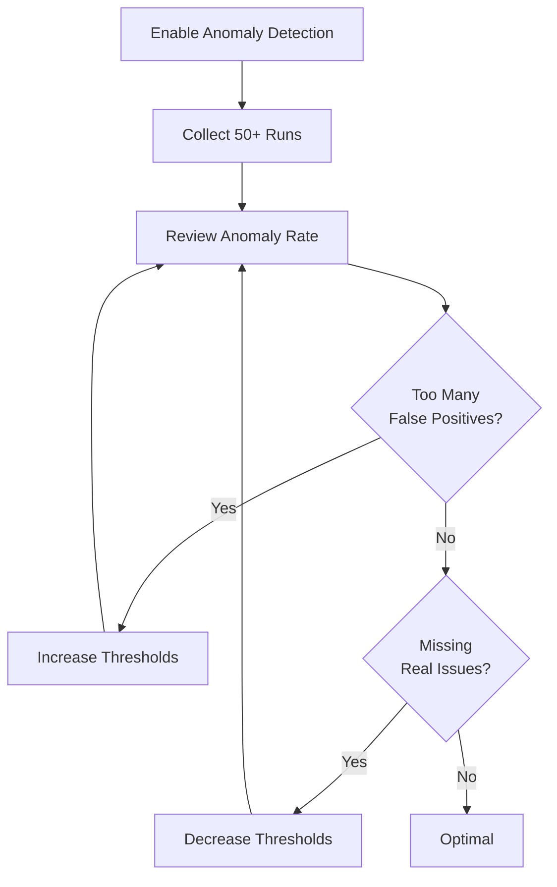

# Anomaly Tuning

Anomaly detection requires tuning to match your job characteristics. Too sensitive = alert fatigue, too lenient = missed issues.

## The Tuning Process



## Step 1: Baseline Collection

**First 2 weeks**: Don't tune anything, just collect data.

- Let baseline stabilize (≥50 runs)
- Review duration distribution
- Check for natural patterns

## Step 2: Evaluate Current State

Go to **Monitor → Analytics → Anomalies** and review:

### Key Metrics

| Metric | Formula | Target |
|--------|---------|--------|
| **False Positive Rate** | False anomalies / Total anomalies | < 10% |
| **Anomaly Rate** | Anomalies / Total runs | 1-5% |
| **Coefficient of Variation** | Std Dev / Mean | < 0.3 for consistent jobs |

### Example Review

```
Monitor: Daily Backup
Total runs: 100
Anomalies: 15
False positives: 12 (80%)

Analysis: WAY too sensitive
```

## Step 3: Adjust Thresholds

### Z-Score Threshold

**Default**: 3.0 standard deviations

**For consistent jobs** (CV < 0.2):
```json
{
  "zScore": {
    "threshold": 2.5  // More sensitive
  }
}
```

**For variable jobs** (CV > 0.5):
```json
{
  "zScore": {
    "threshold": 4.0  // Less sensitive
  }
}
```

### Median Multiplier Threshold

**Default**: 5.0× median

**For stable jobs**:
```json
{
  "medianMultiplier": {
    "threshold": 3.0  // Catch 3x slowdowns
  }
}
```

**For highly variable jobs**:
```json
{
  "medianMultiplier": {
    "threshold": 10.0  // Only extreme spikes
  }
}
```

### Output Size Drop Threshold

**Default**: 50% drop

**For critical data exports**:
```json
{
  "outputSizeDrop": {
    "threshold": 0.3,  // Alert on 30% drop
    "minMedianBytes": 10240  // Ignore if median < 10 KB
  }
}
```

**For less critical**:
```json
{
  "outputSizeDrop": {
    "threshold": 0.8  // Only alert on 80%+ drop
  }
}
```

## Common Scenarios

### Scenario 1: Too Many False Positives

**Symptoms**:
- Anomaly alerts multiple times per week
- Team ignoring alerts (alert fatigue)
- Most anomalies are "actually fine"

**Example**:
```
Monitor: Report Generation
Mean: 10 minutes
Std Dev: 5 minutes (high variance)
Current Z-Score threshold: 3.0

Recent anomalies:
- 26 min (Z=3.2) - Actually fine, just more data
- 27 min (Z=3.4) - Fine
- 29 min (Z=3.8) - Fine
```

**Solution**: Increase threshold or use median multiplier

```json
{
  "zScore": {
    "enabled": false  // Disable for high-variance jobs
  },
  "medianMultiplier": {
    "enabled": true,
    "threshold": 5.0  // Only alert if 5x slower than median
  }
}
```

---

### Scenario 2: Missing Real Issues

**Symptoms**:
- Job performance degrading but no alerts
- Issues only caught when job fails completely
- Threshold too lenient

**Example**:
```
Monitor: Database Backup
Typical: 8-10 minutes
Recent trend: 12 → 15 → 18 → 22 minutes
Median Multiplier threshold: 5.0x (50 minutes)

Problem: Degradation not caught until failure
```

**Solution**: Lower threshold or enable Z-Score

```json
{
  "zScore": {
    "enabled": true,
    "threshold": 2.5  // More sensitive
  },
  "medianMultiplier": {
    "enabled": true,
    "threshold": 2.0  // Alert at 2x slower
  }
}
```

---

### Scenario 3: Legitimate Variability

**Symptoms**:
- Job legitimately varies (time of day, data volume)
- Cannot use strict thresholds

**Example**:
```
Monitor: ETL Pipeline
Monday: 20 min (lots of weekend data)
Tuesday-Friday: 5-8 min (normal)
Saturday-Sunday: 3 min (low traffic)
```

**Solution 1**: Split into separate monitors

```json
[
  {
    "name": "ETL - Weekdays",
    "schedule": {"type": "cron", "expression": "0 3 * * 1-5"},
    "zScore": {"threshold": 3.0}
  },
  {
    "name": "ETL - Weekends",
    "schedule": {"type": "cron", "expression": "0 3 * * 0,6"},
    "zScore": {"threshold": 3.0}
  }
]
```

**Solution 2**: Use maintenance windows

```json
{
  "name": "ETL Pipeline",
  "maintenanceWindows": [
    {
      "name": "Monday Peak",
      "rrule": "FREQ=WEEKLY;BYDAY=MO",
      "duration": 3600  // Suppress Monday anomalies
    }
  ]
}
```

---

### Scenario 4: Bimodal Distribution

**Symptoms**:
- Two distinct performance profiles
- "Fast path" and "slow path" in same job

**Example**:
```
Monitor: Image Processing
Fast path (cache hit): 2-5 seconds (90% of runs)
Slow path (cache miss): 30-60 seconds (10% of runs)
```

**Solution**: Disable Z-Score, use median multiplier

```json
{
  "zScore": {
    "enabled": false  // Mean is misleading in bimodal distribution
  },
  "medianMultiplier": {
    "enabled": true,
    "threshold": 10.0  // Only catch extreme outliers
  }
}
```

Or: Refactor job to use separate monitors for fast/slow paths.

---

### Scenario 5: Growing Job

**Symptoms**:
- Job handles more data over time
- Baseline keeps shifting
- Constant anomalies as job grows

**Example**:
```
Month 1: Mean 10 min
Month 2: Mean 12 min
Month 3: Mean 15 min
Each month: "Anomaly" because growing
```

**Solution**: Rolling baseline window

```json
{
  "anomalyDetection": {
    "baselineWindow": 50  // Only consider last 50 runs
  }
}
```

Saturn automatically adapts baseline as job grows.

## Interpreting Z-Scores

### Z-Score Guidelines

| Z-Score Range | Interpretation | Action |
|---------------|----------------|--------|
| < 1.0 | Normal | None |
| 1.0 - 2.0 | Slightly elevated | Monitor |
| 2.0 - 3.0 | Noteworthy | Review if recurring |
| 3.0 - 4.0 | **Anomalous** | Investigate |
| 4.0 - 6.0 | Highly anomalous | Immediate attention |
| > 6.0 | Extreme outlier | Critical issue |

### Example Incident Messages

**Z-Score: 3.2**
```
ANOMALY: Duration slightly outside normal range
Duration: 19.8 minutes
Mean: 12.5 minutes (±2.1)
Z-Score: 3.2

This is mildly anomalous. Check for:
- Slightly increased data volume
- Minor resource contention
- Small configuration changes
```

**Z-Score: 8.5**
```
ANOMALY: Duration EXTREMELY anomalous
Duration: 45.3 minutes
Mean: 12.5 minutes (±2.1)
Z-Score: 8.5

This is a critical outlier. Likely causes:
- Major infrastructure issue
- Database performance problem
- Significant code regression
```

## Testing Thresholds

Before applying changes, test against historical data:

### Via Dashboard

1. Go to **Monitor → Analytics**
2. Click **Test Anomaly Rules**
3. Adjust thresholds
4. See which past runs would trigger
5. Review false positive rate
6. Apply if satisfied

### Via API

```bash
curl -X POST https://api.saturn.example.com/api/monitors/YOUR_MONITOR_ID/test-anomaly-rules \
  -H "Authorization: Bearer YOUR_TOKEN" \
  -d '{
    "zScore": {"threshold": 2.5},
    "medianMultiplier": {"threshold": 4.0},
    "outputSizeDrop": {"threshold": 0.5}
  }'
```

Response shows which historical runs would trigger.

## Advanced Tuning

### Per-Environment Thresholds

```json
{
  "name": "API Sync - Production",
  "zScore": {"threshold": 2.5},  // Strict
  "tags": ["env:prod"]
},
{
  "name": "API Sync - Staging",
  "zScore": {"threshold": 4.0},  // Lenient
  "tags": ["env:staging"]
}
```

### Time-Based Sensitivity

Future feature: Different thresholds by time/day.

```json
{
  "anomalyDetection": {
    "rules": {
      "zScore": {
        "threshold": 3.0,
        "overrides": [
          {
            "days": ["Monday"],
            "threshold": 4.0  // More lenient on Mondays
          }
        ]
      }
    }
  }
}
```

### Combining Rules

Use multiple rules with AND/OR logic:

```json
{
  "anomalyDetection": {
    "logic": "OR",  // Trigger if ANY rule matches (default)
    "rules": {
      "zScore": {"enabled": true, "threshold": 3.0},
      "medianMultiplier": {"enabled": true, "threshold": 5.0}
    }
  }
}
```

Or require multiple rules:

```json
{
  "anomalyDetection": {
    "logic": "AND",  // Trigger only if ALL rules match
    "rules": {
      "zScore": {"enabled": true, "threshold": 2.0},
      "outputSizeDrop": {"enabled": true, "threshold": 0.5}
    }
  }
}
```

## Best Practices

### ✅ Do

1. **Start conservative** (high thresholds), tighten over time
2. **Review weekly** for first month after enabling
3. **Document legitimate anomalies** (e.g., "Monday peak expected")
4. **Use tags** to organize monitors with similar characteristics
5. **Test changes** before applying to production

### ❌ Don't

1. **Over-tune** — some noise is acceptable
2. **Ignore patterns** — recurring anomalies indicate real issues
3. **Use same thresholds everywhere** — jobs differ
4. **Disable alerts** — tune instead
5. **Forget to re-evaluate** — job characteristics change

## Monitoring Tuning Effectiveness

Track these metrics over time:

```
False Positive Rate = (Acknowledged as false / Total anomalies) × 100%

Target: < 10%
```

```
Time to Detection = (First anomaly alert) - (Performance degradation start)

Target: < 1 day
```

```
Alert Fatigue = (Ignored alerts / Total alerts) × 100%

Target: < 5%
```

## Next Steps

- [Analytics](../analytics/health-score) — Visualize performance trends
- [Incident Lifecycle](../incidents/lifecycle) — Managing anomaly incidents
- [Health Scores](../analytics/health-score) — Understanding overall health

