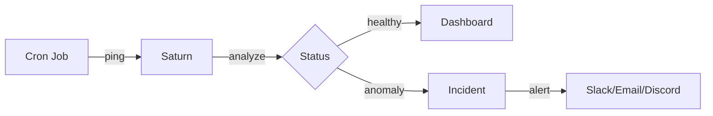

# What is Saturn?

**Saturn** is next-generation monitoring for scheduled jobs and cron tasks. Unlike traditional "ping or fail" monitors, Saturn combines health checking with **statistical anomaly detection**, giving you insights into when jobs run slower than normal, even if they technically succeed.

## 60-Second Overview

Saturn monitors your scheduled jobs by listening for **pings** at expected intervals. When jobs miss their schedule, fail, or behave abnormally, Saturn creates **incidents** and sends **alerts** through your preferred channels (Email, Slack, Discord, Webhooks).

## Why Saturn?

### Traditional Monitoring Problems

❌ **Binary thinking**: Jobs either succeed or fail, no nuance  
❌ **No context**: Duration spike from 10s to 5min? You'll miss it  
❌ **Alert fatigue**: Too many false positives, or too many missed issues  
❌ **Manual setup**: Complex configurations, vendor lock-in

### Saturn Solutions

✅ **Anomaly detection**: Automatic statistical analysis finds outliers  
✅ **Health scores**: 0-100 grading with A-F ratings per monitor  
✅ **MTTR/MTBF tracking**: Mean time to repair & between failures  
✅ **Zero-code Kubernetes**: Helm chart + sidecar, done in 60 seconds  
✅ **WordPress native**: Plugin for wp-cron monitoring at scale

## Key Outcomes

After setting up Saturn, you'll have:

1. **Visibility**: Real-time dashboard showing all job health
2. **Early warnings**: Catch performance degradation before failures
3. **Faster resolution**: Incident timeline with full context
4. **Reliability metrics**: Track uptime, MTTR, MTBF over time
5. **Peace of mind**: Multi-channel alerts you can trust

## Core Concepts

### Monitors

A **monitor** represents a single scheduled job. It has:
- A unique ping URL
- An expected schedule (interval or cron expression)
- Grace period settings
- Statistical baseline (after ≥10 runs)

### Pings

Your jobs send **pings** to Saturn:
- **Start ping**: Job begins execution
- **Success ping**: Job completes successfully (includes duration)
- **Fail ping**: Job fails (includes exit code and error output)

### Incidents

When something goes wrong, Saturn creates an **incident**:
- **MISSED**: Job didn't ping when expected
- **LATE**: Job pinged after grace period expired
- **FAIL**: Job reported failure
- **ANOMALY**: Job succeeded but duration/output anomalous

### Alerts

Incidents trigger **alerts** via:
- Email (transactional, high deliverability)
- Slack (rich Block Kit messages, threaded updates)
- Discord (webhooks with embeds)
- Webhooks (custom integrations with HMAC signatures)

## Next Steps

Choose your path based on your environment:

- **[Kubernetes](./quickstart-kubernetes)** → Helm chart + sidecar
- **[WordPress](./quickstart-wordpress)** → Plugin install
- **[Linux cron](./quickstart-linux-cron)** → curl or CLI
- **[CI/CD](./quickstart-ci)** → GitHub Actions / GitLab

:::tip First-time users
We recommend starting with the [Choose Your Path](./choose-your-path) guide to find the quickest setup for your use case.
:::

