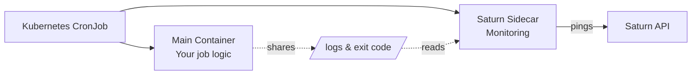

# Kubernetes CronJobs in 60 Seconds

Monitor Kubernetes CronJobs with zero code changes using our Helm chart and sidecar pattern.

## Prerequisites

- `kubectl` configured with cluster access
- Helm 3.x installed
- Permissions to create CronJobs and RBAC resources
- A Saturn organization token (get one from [dashboard](https://saturn.example.com))

:::tip Organization Tokens
Create an org-wide token in **Settings → Tokens** to avoid per-monitor setup. The sidecar will auto-register new monitors.
:::

## Installation

### 1. Add Helm Repository

```bash
helm repo add saturn https://charts.saturn.example.com
helm repo update
```

### 2. Install with Helm

Replace `YOUR_ORG_TOKEN` with your actual token:

```bash
helm install nightly-backup saturn/saturn-monitor \
  --set saturn.token=YOUR_ORG_TOKEN \
  --set cronjob.schedule="0 3 * * *" \
  --set cronjob.container.image="your-backup-image:latest" \
  --set cronjob.container.command='["/bin/sh"]' \
  --set cronjob.container.args='["-c", "./backup.sh"]'
```

### 3. Validate Deployment

Check that the CronJob was created:

```bash
kubectl get cronjob nightly-backup
```

Expected output:
```
NAME             SCHEDULE      SUSPEND   ACTIVE   LAST SCHEDULE   AGE
nightly-backup   0 3 * * *     False     0        <none>          30s
```

## How It Works

The Helm chart deploys a CronJob with **two containers**:



The **Saturn sidecar**:
1. Sends a **start ping** when the pod begins
2. Waits for the main container to complete
3. Sends **success/fail ping** with duration and exit code
4. Captures stdout/stderr if enabled

## Configuration Options

### Basic Example with Output Capture

```yaml title="values.yaml"
saturn:
  token: "YOUR_ORG_TOKEN"
  apiUrl: "https://api.saturn.example.com"  # Optional: use self-hosted
  captureOutput: true
  maxOutputBytes: 10240  # 10KB limit

cronjob:
  name: my-backup
  schedule: "0 3 * * *"
  timezone: "America/New_York"  # Optional
  
  container:
    name: backup
    image: backup-tool:v1.2
    command: ["/bin/bash"]
    args: ["-c", "./run-backup.sh"]
    
    resources:
      limits:
        cpu: "1000m"
        memory: "1Gi"
      requests:
        cpu: "200m"
        memory: "256Mi"

  # Job retry configuration
  backoffLimit: 2
  restartPolicy: OnFailure
```

Install with custom values:

```bash
helm install my-backup saturn/saturn-monitor -f values.yaml
```

### Advanced: Multiple CronJobs

To monitor multiple jobs, install the chart multiple times:

```bash
# Backup job
helm install backup saturn/saturn-monitor \
  --set saturn.token=YOUR_ORG_TOKEN \
  --set cronjob.schedule="0 3 * * *" \
  --set cronjob.container.image="backup:latest"

# Cleanup job
helm install cleanup saturn/saturn-monitor \
  --set saturn.token=YOUR_ORG_TOKEN \
  --set cronjob.schedule="0 4 * * *" \
  --set cronjob.container.image="cleanup:latest"
```

## Verify First Ping

After the job runs (or trigger manually), check the Saturn dashboard:

```bash
# Trigger a manual run for testing
kubectl create job test-run-1 --from=cronjob/nightly-backup
```

Within seconds, you should see:
- New monitor appears in dashboard
- First ping recorded
- Duration tracked

:::tip Manual testing
Use `kubectl create job --from=cronjob/...` to test immediately without waiting for the schedule.
:::

## Connect Alerts

Add Slack/Discord/Email alerts:

1. Go to **Settings → Integrations**
2. Connect your preferred channel
3. Configure routing rules
4. Test with a manual failure

## Common Issues

### imagePullBackOff

**Problem**: Sidecar image can't be pulled

**Solution**: Check image registry access and pull secrets:

```bash
kubectl describe pod <pod-name>
```

### Timezone Not Working

**Problem**: Schedule runs at wrong time

**Solution**: Verify timezone support in your cluster (requires Kubernetes 1.25+):

```bash
kubectl version --short
```

For older clusters, use UTC and adjust schedule accordingly.

### Sidecar Not Reporting

**Problem**: Job runs but no pings appear

**Solution**: Check sidecar logs:

```bash
kubectl logs <pod-name> -c saturn-sidecar
```

Common causes:
- Invalid token
- Network policy blocking egress
- API endpoint unreachable

## Resource Recommendations

| Job Duration | Sidecar CPU | Sidecar Memory |
|--------------|-------------|----------------|
| < 5 min | 50m | 64Mi |
| 5-30 min | 100m | 128Mi |
| > 30 min | 200m | 256Mi |

## Next Steps

**You should now see your first healthy monitor within 10 minutes.**

Explore more:

- [Helm Values Reference](../../kubernetes/helm-values) for all configuration options
- [Sidecar Architecture](../../kubernetes/sidecar) to understand how it works
- [Examples](../../kubernetes/examples) for real-world use cases
- [Anomaly Detection](../../anomalies/overview) to catch performance regressions

