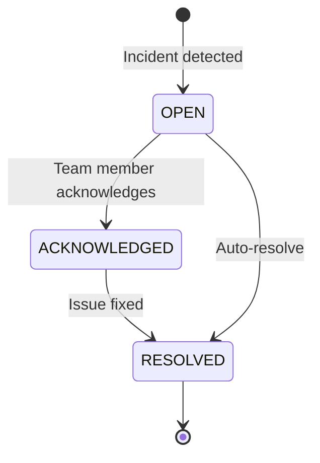

# Incident Lifecycle

Incidents flow through states from detection to resolution. Understanding the lifecycle helps teams coordinate response.

## Incident States



### OPEN

**When**: Incident first detected

**Characteristics**:
- Alerts sent immediately
- Dashboard shows red badge
- Incident appears at top of list
- Timer starts for MTTR calculation

**Actions**:
- Review incident details
- Check captured output
- Investigate root cause
- Acknowledge to signal ownership

### ACKNOWLEDGED

**When**: Team member clicks "Acknowledge"

**Characteristics**:
- No new alerts sent for this incident
- Dashboard shows yellow badge
- Timestamp of acknowledgment recorded
- Acknowledging user tracked

**Purpose**:
- Signal "someone is working on it"
- Prevent duplicate work
- Stop alert spam
- Track response time

**Example**:

```bash
# Via API
curl -X POST https://api.saturn.example.com/api/incidents/YOUR_INCIDENT_ID/acknowledge \
  -H "Authorization: Bearer YOUR_TOKEN" \
  -d '{"userId": "user_abc123", "note": "Investigating database connection"}'
```

### RESOLVED

**When**: Issue fixed and incident manually resolved, or auto-resolved

**Characteristics**:
- Dashboard shows green badge
- Incident moves to history
- MTTR calculated and recorded
- Resolution note stored

**Auto-Resolution Triggers**:
- Next successful ping received
- Manual resolution by team member
- Maintenance window ends (optional)

**Example**:

```bash
# Via API
curl -X POST https://api.saturn.example.com/api/incidents/YOUR_INCIDENT_ID/resolve \
  -H "Authorization: Bearer YOUR_TOKEN" \
  -d '{"userId": "user_abc123", "note": "Database credentials rotated, backup completed successfully"}'
```

## Incident Timeline

Every incident maintains a detailed event log:

```json
{
  "id": "inc_abc123",
  "monitorId": "mon_xyz789",
  "type": "FAIL",
  "status": "RESOLVED",
  "timeline": [
    {
      "timestamp": "2025-10-14T10:15:00Z",
      "event": "CREATED",
      "details": {
        "exitCode": 1,
        "output": "Database connection failed"
      }
    },
    {
      "timestamp": "2025-10-14T10:15:02Z",
      "event": "ALERTS_SENT",
      "details": {
        "channels": ["slack", "email"],
        "recipients": 3
      }
    },
    {
      "timestamp": "2025-10-14T10:17:30Z",
      "event": "ACKNOWLEDGED",
      "details": {
        "userId": "user_abc123",
        "userName": "Alice",
        "note": "Checking database logs"
      }
    },
    {
      "timestamp": "2025-10-14T10:22:00Z",
      "event": "NOTE_ADDED",
      "details": {
        "userId": "user_abc123",
        "note": "Found issue: connection pool exhausted"
      }
    },
    {
      "timestamp": "2025-10-14T10:28:00Z",
      "event": "RESOLVED",
      "details": {
        "userId": "user_abc123",
        "note": "Increased connection pool size, backup rerun successful"
      }
    }
  ],
  "mttr": 780  // 13 minutes (780 seconds)
}
```

## Deduplication

Saturn prevents alert spam by deduplicating incidents.

### Same Incident Type

If a monitor already has an OPEN incident of the same type:

**Option 1: Update Existing** (default)
- Adds new occurrence to timeline
- Updates incident count
- No new alerts sent

**Option 2: Create New**
- Creates separate incident
- Alerts sent for each
- Useful for tracking multiple failures

Configure per monitor:

```json
{
  "name": "Critical Job",
  "deduplication": {
    "strategy": "update_existing",  // or "create_new"
    "windowSeconds": 3600  // Dedupe within 1 hour
  }
}
```

### Example: Multiple Fails

```
Monitor: Database Backup

Timeline:
10:00 - FAIL (Exit code 1) → Incident #1 OPEN, alerts sent
10:05 - FAIL (Exit code 1) → Update Incident #1, no new alerts
10:10 - FAIL (Exit code 1) → Update Incident #1, no new alerts
10:15 - SUCCESS → Auto-resolve Incident #1

Result: 1 incident with 3 failed runs, 1 alert sent
```

## Suppression

Temporarily silence alerts without disabling the monitor.

### Use Cases

1. **Known Issues**: Issue identified, fix in progress
2. **Maintenance Windows**: Planned downtime (see [Maintenance Windows](./maintenance-windows))
3. **Flaky Jobs**: Investigating intermittent failures
4. **External Dependencies**: Third-party service down

### Manual Suppression

In dashboard:
1. Open incident
2. Click **Suppress Alerts**
3. Set duration (15 min, 1 hour, 4 hours, 24 hours, custom)
4. Confirm

Effects:
- Incidents still created
- No alerts sent
- Dashboard still shows incidents
- Suppression expires automatically

### Suppression Rules

Create rules for recurring suppression:

```json
{
  "monitorId": "mon_xyz789",
  "suppress": {
    "days": ["Saturday", "Sunday"],
    "hours": [0, 1, 2, 3, 4, 5],  // Midnight to 6 AM
    "types": ["LATE"]  // Only suppress LATE incidents
  }
}
```

### API Example

```bash
# Suppress for 2 hours
curl -X POST https://api.saturn.example.com/api/incidents/YOUR_INCIDENT_ID/suppress \
  -H "Authorization: Bearer YOUR_TOKEN" \
  -d '{"durationSeconds": 7200, "reason": "Database maintenance in progress"}'

# Remove suppression early
curl -X DELETE https://api.saturn.example.com/api/incidents/YOUR_INCIDENT_ID/suppress \
  -H "Authorization: Bearer YOUR_TOKEN"
```

## Alert Routing

Control who gets alerted for which incidents.

### Default Routing

All alert channels receive all incident types.

### Advanced Routing Rules

```json
{
  "rules": [
    {
      "name": "Critical to PagerDuty",
      "condition": {
        "severity": ["HIGH"],
        "types": ["MISSED", "FAIL"]
      },
      "channels": ["pagerduty"],
      "escalation": {
        "delayMinutes": 15,
        "fallback": ["slack:oncall"]
      }
    },
    {
      "name": "Anomalies to Slack",
      "condition": {
        "types": ["ANOMALY"]
      },
      "channels": ["slack:monitoring"]
    },
    {
      "name": "Non-urgent to Email",
      "condition": {
        "severity": ["LOW", "MEDIUM"],
        "types": ["LATE"]
      },
      "channels": ["email"]
    }
  ]
}
```

## Incident Notes

Add investigation notes to incidents:

### Via Dashboard

1. Open incident
2. Scroll to "Notes" section
3. Type note and click **Add**

### Via API

```bash
curl -X POST https://api.saturn.example.com/api/incidents/YOUR_INCIDENT_ID/notes \
  -H "Authorization: Bearer YOUR_TOKEN" \
  -d '{"note": "Restarted service, monitoring for next run"}'
```

### Markdown Support

Notes support markdown:

```markdown
## Investigation

- [x] Checked server logs
- [x] Verified disk space
- [ ] Review with database team

**Root cause**: Connection pool exhausted during peak load

**Fix**: Increased pool size from 10 to 20
```

## Bulk Actions

Manage multiple incidents at once:

### Acknowledge All

```bash
# Acknowledge all OPEN incidents for a monitor
curl -X POST https://api.saturn.example.com/api/monitors/YOUR_MONITOR_ID/incidents/acknowledge-all \
  -H "Authorization: Bearer YOUR_TOKEN"
```

### Auto-Resolve on Success

Default behavior: Next successful ping auto-resolves OPEN incidents.

Disable per monitor:

```json
{
  "name": "My Monitor",
  "autoResolve": false  // Require manual resolution
}
```

## Incident Reports

Export incident data for analysis:

### Via Dashboard

1. Go to **Incidents** page
2. Apply filters (date range, monitor, type)
3. Click **Export CSV** or **Export JSON**

### Via API

```bash
curl -X GET "https://api.saturn.example.com/api/incidents?from=2025-10-01&to=2025-10-14&format=csv" \
  -H "Authorization: Bearer YOUR_TOKEN" \
  > incidents.csv
```

## Best Practices

### ✅ Do

1. **Acknowledge promptly** to prevent duplicate work
2. **Add notes** during investigation for future reference
3. **Review patterns** weekly to identify recurring issues
4. **Set up routing** to avoid alert fatigue
5. **Use suppression** for known issues during fixes

### ❌ Don't

1. **Auto-acknowledge everything** — defeats the purpose
2. **Ignore low-severity incidents** — they can indicate larger problems
3. **Delete incidents** — historical data is valuable
4. **Over-suppress** — might miss real issues

## Incident Metrics

Track incident management effectiveness:

| Metric | Formula | Target |
|--------|---------|--------|
| **MTTR** | Time from OPEN to RESOLVED | < 30 min |
| **Acknowledgment Time** | Time from OPEN to ACKED | < 5 min |
| **Resolution Rate** | Resolved / Total incidents | > 95% |
| **Recurring Incidents** | Same issue in 7 days | < 10% |

View in **Analytics → Incidents** dashboard.

## Next Steps

- [Maintenance Windows](./maintenance-windows) — Schedule planned downtime
- [Alert Channels](../alerts/email) — Configure notification channels
- [Analytics](../analytics/mtbf-mttr) — Track MTTR and MTBF trends

