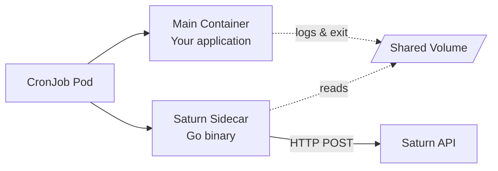

# Kubernetes Sidecar

The Saturn sidecar is a lightweight Go container that monitors your CronJob's main container and reports status to Saturn.

## Architecture



## How It Works

### 1. Pod Starts

Both containers start simultaneously:
- **Main container**: Runs your job logic
- **Sidecar**: Waits for main container

### 2. Start Ping

Sidecar sends start ping to Saturn immediately:

```go
POST /api/ping/YOUR_MONITOR_ID/start
Authorization: Bearer YOUR_ORG_TOKEN
```

### 3. Monitor Main Container

Sidecar polls Kubernetes API for main container status:

```go
for {
    status := getPodStatus(namespace, podName)
    if status.MainContainer.State.Terminated != nil {
        break
    }
    time.Sleep(2 * time.Second)
}
```

### 4. Collect Metrics

When main container exits:

```go
exitCode := status.MainContainer.State.Terminated.ExitCode
duration := finishedAt.Sub(startedAt)
```

### 5. Capture Logs (Optional)

If enabled, read stdout/stderr:

```bash
kubectl logs <pod-name> -c main --tail=100
```

### 6. Send Final Ping

```go
if exitCode == 0 {
    POST /api/ping/YOUR_MONITOR_ID/success
    Body: {durationMs, output}
} else {
    POST /api/ping/YOUR_MONITOR_ID/fail
    Body: {exitCode, durationMs, output}
}
```

### 7. Exit

Sidecar exits after sending ping, allowing pod to complete.

## Environment Variables

### Required

| Variable | Description |
|----------|-------------|
| `SATURN_TOKEN` | Organization or monitor token |
| `SATURN_MONITOR_ID` | Monitor ID (or auto-created) |

### Optional

| Variable | Default | Description |
|----------|---------|-------------|
| `SATURN_API_URL` | `https://api.saturnmonitor.com` | API endpoint |
| `SATURN_CAPTURE_OUTPUT` | `false` | Capture logs |
| `SATURN_MAX_OUTPUT_BYTES` | `10240` | Max log size (bytes) |
| `SATURN_TIMEOUT` | `300` | Max wait for main container (seconds) |
| `POD_NAME` | (required) | From `metadata.name` |
| `POD_NAMESPACE` | `default` | From `metadata.namespace` |

## Configuration Examples

### Basic

```yaml
apiVersion: batch/v1
kind: CronJob
metadata:
  name: backup
spec:
  schedule: "0 3 * * *"
  jobTemplate:
    spec:
      template:
        spec:
          containers:
          - name: main
            image: backup:latest
            command: ["./backup.sh"]
          
          - name: saturn-sidecar
            image: saturn/k8s-sidecar:1.0.0
            env:
            - name: SATURN_TOKEN
              valueFrom:
                secretKeyRef:
                  name: saturn-secrets
                  key: token
            - name: SATURN_MONITOR_ID
              value: "mon_abc123"
            - name: POD_NAME
              valueFrom:
                fieldRef:
                  fieldPath: metadata.name
            - name: POD_NAMESPACE
              valueFrom:
                fieldRef:
                  fieldPath: metadata.namespace
          
          restartPolicy: OnFailure
          serviceAccountName: saturn-monitor
```

### With Output Capture

```yaml
- name: saturn-sidecar
  image: saturn/k8s-sidecar:1.0.0
  env:
  - name: SATURN_CAPTURE_OUTPUT
    value: "true"
  - name: SATURN_MAX_OUTPUT_BYTES
    value: "51200"  # 50 KB
```

### With Custom API URL

```yaml
- name: saturn-sidecar
  image: saturn/k8s-sidecar:1.0.0
  env:
  - name: SATURN_API_URL
    value: "https://saturn.internal.company.com"
```

## RBAC Requirements

Sidecar needs permissions to read pod status:

```yaml
apiVersion: v1
kind: ServiceAccount
metadata:
  name: saturn-monitor
---
apiVersion: rbac.authorization.k8s.io/v1
kind: Role
metadata:
  name: saturn-monitor
rules:
- apiGroups: [""]
  resources: ["pods"]
  verbs: ["get", "list"]
- apiGroups: [""]
  resources: ["pods/log"]
  verbs: ["get"]
---
apiVersion: rbac.authorization.k8s.io/v1
kind: RoleBinding
metadata:
  name: saturn-monitor
roleRef:
  apiGroup: rbac.authorization.k8s.io
  kind: Role
  name: saturn-monitor
subjects:
- kind: ServiceAccount
  name: saturn-monitor
```

## Resource Recommendations

| Job Duration | CPU | Memory |
|--------------|-----|--------|
| < 5 min | 50m | 64Mi |
| 5-30 min | 100m | 128Mi |
| > 30 min | 200m | 256Mi |

Example:

```yaml
- name: saturn-sidecar
  image: saturn/k8s-sidecar:1.0.0
  resources:
    requests:
      cpu: 50m
      memory: 64Mi
    limits:
      cpu: 100m
      memory: 128Mi
```

## Troubleshooting

### Sidecar Not Reporting

**Check logs**:

```bash
kubectl logs <pod-name> -c saturn-sidecar
```

**Common issues**:
- Invalid token
- Missing RBAC permissions
- Network policy blocking egress
- API endpoint unreachable

### Wrong Exit Code Reported

**Cause**: Main container has multiple processes

**Solution**: Ensure main process is PID 1 or use `exec`:

```bash
#!/bin/bash
exec ./actual-command  # Replaces shell with command
```

### Logs Not Captured

**Check**:
1. `SATURN_CAPTURE_OUTPUT=true`?
2. RBAC allows `pods/log` access?
3. Main container has logs?

```bash
# Test manually
kubectl logs <pod-name> -c main
```

### Pod Stuck After Job Completes

**Cause**: Sidecar didn't exit

**Check**: Sidecar logs for errors, ensure timeout not too long

## Next Steps

- [Helm Values Reference](./helm-values) — Full configuration options
- [Examples](./examples) — Real-world CronJob examples

